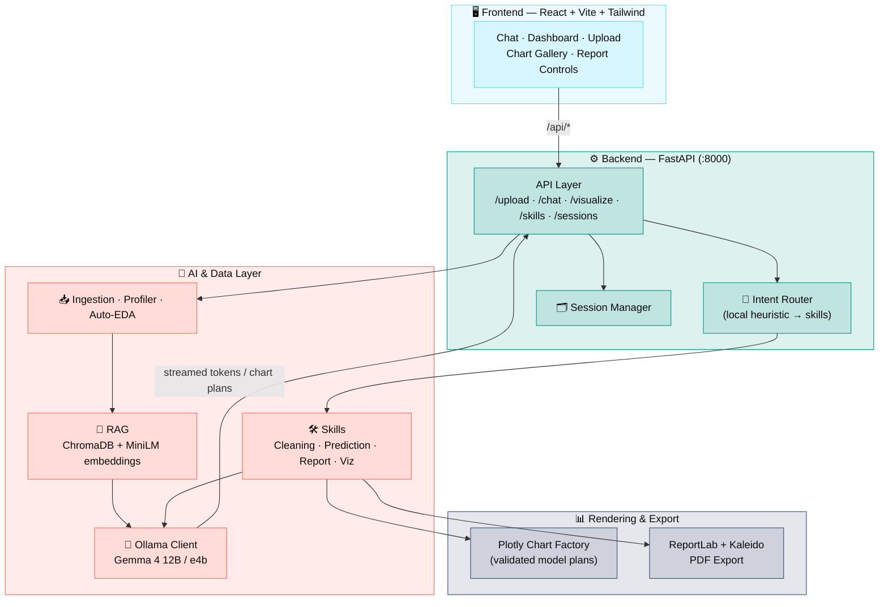
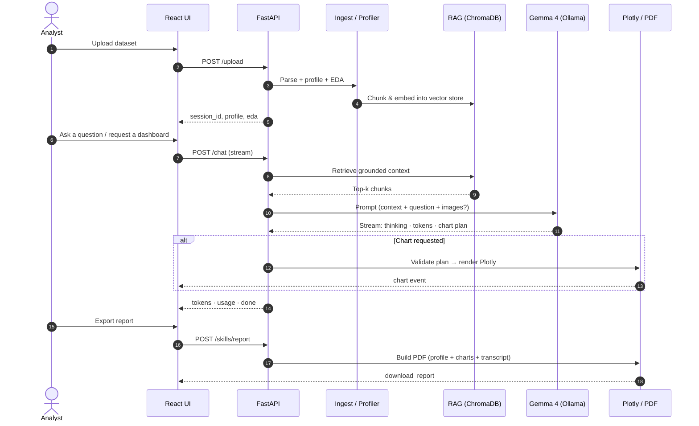

<div align="center">

# 🔬 Universal Analyst

### An LLM-Driven Data Analysis Workspace

*Upload a dataset. Interrogate it in natural language. Get grounded answers, model-generated dashboards, and a professional PDF report — powered by a local multimodal LLM.*

<br/>


<br/>

*DEPI Graduation Project · 6-person team · Built for Lightning.ai & cloud GPU runtimes*

</div>

---

## ✨ What it does

**Universal Analyst** turns any uploaded dataset into an interrogable workspace. It profiles the data, builds a retrieval context, and lets you converse with a **local Gemma 4 model (via Ollama)** that can plan and render **validated Plotly charts** and export a **professional PDF report** — never fabricating results.

> **No fabrication rule:** the UI never substitutes static/placeholder analysis for real model output. Empty and error states say exactly what happened.

| | Feature |
|---|---|
| 📤 | **Universal ingestion** — CSV, JSON, Parquet, PDF tables, and SQLite |
| 🔎 | **Automatic profiling & EDA** — schema, quality signals, distributions |
| 💬 | **Grounded chat** — RAG-backed answers over *your* data, streamed token-by-token |
| 🖼️ | **Multimodal** — attach reference images to a chat turn (Gemma 4 vision path) |
| 🎙️ | **Voice input** — optional browser speech-to-text into the composer |
| 📊 | **Model-driven dashboards** — the model plans charts, the backend validates & renders them |
| 🤖 | **Prediction skill** — quick predictive modeling over the dataset |
| 🧹 | **Cleaning skill** — guided data-cleaning operations |
| 📄 | **PDF reports** — profile, quality signals, generated charts, and transcript |
| 🎛️ | **Token meter** — session-level and per-turn usage, always visible |

---

## 🏗️ System Architecture



### Request lifecycle — from upload to insight



---

## 🧰 Technology Stack

| Layer | Technology |
|-------|------------|
| **Main LLM** | Gemma 4 12B via **Ollama** (multimodal: text + image) |
| **Router model** | Gemma 4 `e4b` (fast local intent routing into skills) |
| **RAG** | **ChromaDB** + `sentence-transformers` (`all-MiniLM-L6-v2`) |
| **Backend** | **FastAPI** (Python 3.12), pydantic-settings |
| **Frontend** | **React 18** + **Vite** + **TailwindCSS** |
| **Visualization** | **Plotly**, generated from validated model chart plans |
| **Reports** | **ReportLab** PDF export with Plotly/**Kaleido** chart embedding |
| **Infra** | **Docker Compose** (dev + prod/nginx), Makefile, GitHub Actions CI |

---

## 📂 Repository Structure

```
DEPI_Graduation_Project_LLM_Driven/
├── backend/                     # FastAPI service (Python 3.12)
│   └── app/
│       ├── api/                 # Route handlers: chat, upload, sessions, clean, predict, visualizations
│       ├── core/                # Ingestion, chunking, profiling, session manager
│       ├── eda/                 # Automated exploratory data analysis
│       ├── llm/                 # Ollama client, prompt templates, token counter
│       ├── rag/                 # ChromaDB store, embedder, retriever, context builder
│       ├── skills/              # Cleaning · Prediction · Report · Report narrative
│       ├── skills_registry/     # Markdown skill/intent definitions
│       ├── visualization/       # Plotly chart factory, chart types, export
│       └── models/              # Pydantic schemas & enums
├── frontend/                    # React + Vite + Tailwind app
│   └── src/
│       ├── components/          # Chat, dashboard, upload, charts, sidebar, palette
│       ├── hooks/               # useChat, useSessions, useFileUpload
│       └── lib/                 # api client, chart/report export, token usage
├── scripts/
│   ├── setup_ollama.sh          # Pull Gemma 4 model tags (cloud/Linux)
│   ├── serve_frontend.sh
│   └── upload/                  # 🪟 Windows .cmd scripts to upload each split
├── docs/                        # API reference & deployment notes
├── data/samples/                # Example datasets
├── main.ipynb                   # One-click cloud (Lightning.ai) setup notebook
├── docker-compose.yml           # Dev (bind-mounts + Vite dev server)
├── docker-compose.prod.yml      # Prod (built images + nginx)
└── Makefile
```

---

## 🚀 Quick Start

### ☁️ Cloud (Lightning.ai / Linux GPU) — recommended

> The Linux/bash tooling and the notebook are how the app **runs** (on a cloud GPU). Windows is used for development and for uploading splits to GitHub.

1. Upload this project to your GPU box.
2. Open **`main.ipynb`** and **Run all cells** (installs deps, pulls `gemma4:12b` + `gemma4:e4b`, starts services).
3. Open the forwarded **`:5173`** URL for the app.
4. Open **`:8000/docs`** for the backend API docs.

### 🐳 Docker

```bash
make up          # dev: backend :8000 + Vite dev server :5173  (Ollama on host)
make prod-up     # prod: built images behind nginx
make down
```

### 🔧 Manual

```bash
bash scripts/setup_ollama.sh
cd backend && pip install -r requirements.txt
uvicorn app.main:app --host 0.0.0.0 --port 8000
cd ../frontend && npm install && npm run dev -- --host
```

Copy **`.env.example` → `.env`** to configure models, Ollama host, RAG budget, and CORS.

---

## 🔌 API Reference

| Method | Path | Description |
|--------|------|-------------|
| `GET` | `/health` | Health check |
| `GET` | `/capabilities` | Frontend capability metadata |
| `POST` | `/upload` | Upload CSV/JSON/Parquet/PDF/SQLite → `session_id`, `profile`, `eda` |
| `POST` | `/chat` | Stream chat events: `skill`, `thinking`, `action`, `token`, `chart`, `usage`, `command`, `error`, `done` |
| `POST` | `/visualize` | Build a Plotly chart from a validated spec |
| `GET` | `/sessions` | List sessions with dataset, message & chart counts |
| `GET` | `/sessions/{id}` | Session details, chat history, generated charts |
| `DELETE` | `/sessions/{id}` | Delete a session |
| `GET` | `/skills` | Active skill manifest |
| `POST` | `/skills/report` | Generate a professional PDF report |

Full details in [`docs/api_reference.md`](docs/api_reference.md) and [`docs/deployment.md`](docs/deployment.md).

---

## 👥 Team & Work Split

A 6-way split where each member owns a coherent, independently-committable slice.

| # | Member | GitHub | Split |
|---|--------|--------|-------|
| 1 | **Ahmed** | [@Ahmedvip62](https://github.com/Ahmedvip62) | 🎨 Frontend — React UI |
| 2 | **Amir** | [@amiressam777](https://github.com/amiressam777) | ⚙️ Backend Core & API + LLM integration |
| 3 | **Shahenda** | [@Shahendawael](https://github.com/Shahendawael) | 🧠 AI — Prompting & RAG |
| 4 | **Doaa** | [@doaa186](https://github.com/doaa186) | 📥 Data Engineering (ingest / profile / clean) |
| 5 | **Maimamoon** | [@maimamoon](https://github.com/maimamoon) | 📊 Visualization & Reporting |
| 6 | **Hesham** | — | 🤖 ML Prediction + DevOps / Infra + Docs |

See [`CONTRIBUTORS.md`](CONTRIBUTORS.md) for exact file ownership, and
[`scripts/upload/`](scripts/upload/) for the per-person upload scripts.

---

## 🎯 Design Principles

- **Readouts are exact** — data renders in a monospaced face (IBM Plex Mono) so it reads like instrument output.
- **No fabrication** — the UI never fakes analysis; error states are honest.
- **One signal, one job** — indigo carries action/focus; amber marks measurement only.
- **Density with rhythm** — information-dense, with hairline structure over nested cards.
- **Accessible** — WCAG AA contrast, visible keyboard focus, `prefers-reduced-motion` fallbacks.

<div align="center">

---

*Universal Analyst — measured, grounded, sharp.*

</div>
