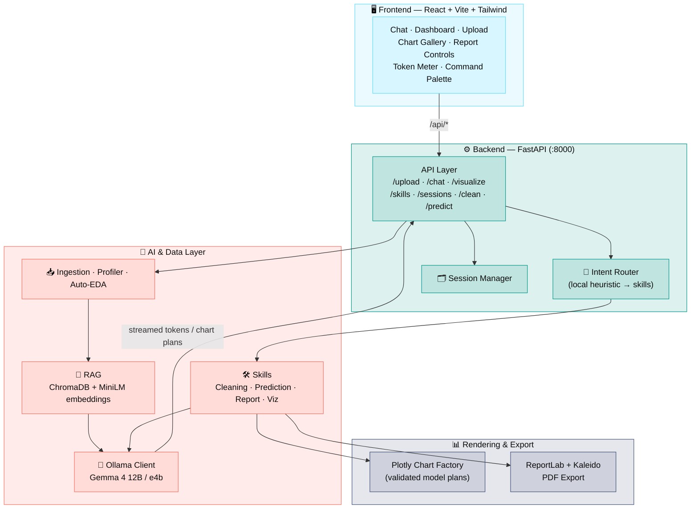
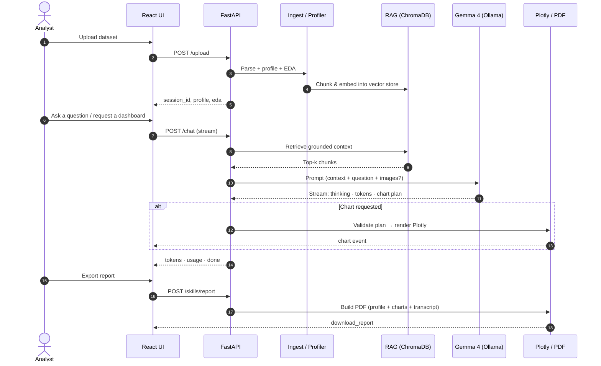
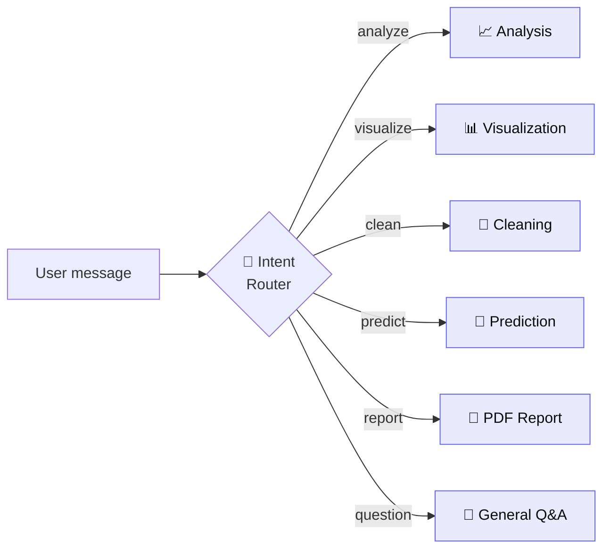

<div align="center">

# 🔬 Universal Analyst

### An LLM-Driven Data Analysis Workspace

*Upload a dataset. Interrogate it in natural language. Get grounded answers, model-generated dashboards, and a professional PDF report — powered by a **local** multimodal LLM.*

<br/>


<br/>

*DEPI Graduation Project · 6-person team · Built for Lightning.ai & cloud GPU runtimes*

</div>

---

## 📑 Table of Contents

- [What it does](#-what-it-does)
- [Why it's different](#-why-its-different)
- [System Architecture](#-system-architecture)
- [Request Lifecycle](#request-lifecycle--from-upload-to-insight)
- [The Skill System](#-the-skill-system)
- [Technology Stack](#-technology-stack)
- [Repository Structure](#-repository-structure)
- [Quick Start](#-quick-start)
- [Configuration](#-configuration)
- [API Reference](#-api-reference)
- [Data Support](#-data-support)
- [Team](#-team)
- [Design Principles](#-design-principles)

---

## ✨ What it does

**Universal Analyst** turns any uploaded dataset into an interrogable workspace. It profiles the data, builds a retrieval context, and lets you converse with a **local Gemma 4 model (via Ollama)** that can plan and render **validated Plotly charts** and export a **professional PDF report** — never fabricating results.

> **🛡️ No-fabrication rule:** the UI never substitutes static or placeholder analysis for real model output. When the model fails, empty and error states say *exactly* what happened.

| | Feature | |
|:---:|---|---|
| 📤 | **Universal ingestion** | CSV, JSON, Parquet, PDF tables, and SQLite (`.sqlite`/`.db`) |
| 🔎 | **Automatic profiling & EDA** | Schema, dtypes, missingness, quality signals, distributions |
| 💬 | **Grounded chat** | RAG-backed answers over *your* data, streamed token-by-token |
| 🖼️ | **Multimodal** | Attach up to 3 reference images per turn (Gemma 4 vision path) |
| 🎙️ | **Voice input** | Optional browser speech-to-text into the composer |
| 📊 | **Model-driven dashboards** | The model *plans* charts; the backend *validates* & renders them |
| 🤖 | **Prediction skill** | Quick predictive modeling over the dataset |
| 🧹 | **Cleaning skill** | Guided, transparent data-cleaning operations |
| 📄 | **PDF reports** | Profile + quality signals + generated charts + transcript |
| 🎛️ | **Token meter** | Session-level *and* per-turn usage, always visible |

---

## 💡 Why it's different

Most "chat with your data" tools quietly hallucinate numbers or ship a canned chart when the model stumbles. Universal Analyst is built as an **instrument**, not a demo:

- **Every chart is a validated model plan.** The LLM emits a strict chart specification; the backend *validates* it against the real schema before a single pixel is rendered. Invalid plans are rejected, not faked.
- **Answers are grounded in retrieval.** Questions are answered against top-k chunks pulled from *your* uploaded data via ChromaDB — not the model's imagination.
- **It runs fully local.** The LLM (Gemma 4 via Ollama) and the embedding model live on your GPU box. No data leaves the runtime.
- **Streaming transparency.** The `/chat` endpoint streams typed events — `skill`, `thinking`, `action`, `token`, `chart`, `usage`, `command`, `error`, `done` — so the UI shows *reasoning as it happens*.

---

## 🏗️ System Architecture



### Request lifecycle — from upload to insight



---

## 🛠️ The Skill System

Incoming requests are classified by a **local heuristic router** (backed by a fast `gemma4:e4b` model) into one of several skills. Each skill has a Markdown definition in `backend/app/skills_registry/` and a Python implementation.



| Skill | Registry file | What it does |
|-------|---------------|--------------|
| **Analysis** | `analysis.md` | Grounded statistical analysis over the profiled data |
| **Visualization** | `visualization.md` | Plans a strict chart spec → validated → rendered as Plotly |
| **Cleaning** | `cleaning.md` | Guided cleaning operations with transparent steps |
| **Prediction** | `prediction.md` | Lightweight predictive modeling on the dataset |
| **Report** | `report.md` | Assembles a professional PDF (profile, charts, transcript) |
| **General Q&A** | `general_qa.md` | Open questions grounded in the retrieval context |

---

## 🧰 Technology Stack

| Layer | Technology |
|-------|------------|
| **Main LLM** | Gemma 4 12B via **Ollama** (multimodal: text + image) |
| **Router model** | Gemma 4 `e4b` (fast local intent routing into skills) |
| **RAG** | **ChromaDB** + `sentence-transformers` (`all-MiniLM-L6-v2`) |
| **Backend** | **FastAPI** (Python 3.12) · `pydantic-settings` · `uvicorn` |
| **Frontend** | **React 18** + **Vite** + **TailwindCSS** |
| **Visualization** | **Plotly**, generated from validated model chart plans |
| **PDF ingest** | **pdfplumber** for extracting tables from PDF uploads |
| **Reports** | **ReportLab** PDF export with Plotly/**Kaleido** chart embedding |
| **Infra** | **Docker Compose** (dev + prod/nginx) · Makefile · GitHub Actions CI |

---

## 📂 Repository Structure

```
DEPI_Graduation_Project_LLM_Driven/
├── backend/                     # FastAPI service (Python 3.12)
│   └── app/
│       ├── api/                 # Routes: chat, upload, sessions, clean, predict,
│       │                        #         visualizations, skills, health
│       ├── core/                # Ingestion, chunking, profiling, session manager
│       ├── eda/                 # Automated exploratory data analysis
│       ├── llm/                 # Ollama client, prompt templates, token counter
│       ├── rag/                 # ChromaDB store, embedder, retriever, context builder
│       ├── skills/              # Cleaning · Prediction · Report · Report narrative
│       ├── skills_registry/     # Markdown skill/intent definitions
│       ├── visualization/       # Plotly chart factory, chart types, export
│       ├── models/              # Pydantic schemas & enums
│       ├── config.py            # Settings (env-driven, pydantic-settings)
│       └── main.py              # App entrypoint + CORS + router mount
├── frontend/                    # React + Vite + Tailwind app
│   └── src/
│       ├── components/          # Chat, dashboard, upload, charts, sidebar, palette
│       ├── hooks/               # useChat, useSessions, useFileUpload
│       └── lib/                 # api client, chart/report export, token usage
├── scripts/
│   ├── setup_ollama.sh          # Pull Gemma 4 model tags (cloud/Linux)
│   └── serve_frontend.sh
├── docs/                        # API reference & deployment notes
├── data/samples/                # Example datasets (CSV + JSON)
├── main.ipynb                   # One-click cloud (Lightning.ai) setup notebook
├── docker-compose.yml           # Dev (bind-mounts + Vite dev server)
├── docker-compose.prod.yml      # Prod (built images + nginx)
├── Makefile                     # up / down / build / test / lint / prod-up
└── .env.example                 # Configuration template
```

---

## 🚀 Quick Start

### ☁️ Cloud (Lightning.ai / Linux GPU) — recommended

> The Linux/bash tooling and the notebook are how the app **runs** (on a cloud GPU with the LLM local to the box).

1. Upload this project to your GPU box.
2. Open **`main.ipynb`** and **Run all cells** — installs deps, pulls `gemma4:12b` + `gemma4:e4b`, and starts both services.
3. Open the forwarded **`:5173`** URL for the app.
4. Open **`:8000/docs`** for interactive backend API docs (Swagger UI).

> If a required model tag is unavailable, setup **stops with a real error** so the runtime can be fixed directly — it does not silently degrade.

### 🐳 Docker

```bash
make up          # dev:  backend :8000 + Vite dev server :5173  (Ollama on host)
make prod-up     # prod: built images behind nginx
make down        # stop
make logs        # follow logs
```

### 🔧 Manual

```bash
bash scripts/setup_ollama.sh
cd backend && pip install -r requirements.txt
uvicorn app.main:app --host 0.0.0.0 --port 8000
cd ../frontend && npm install && npm run dev -- --host
```

> **Routing note:** the backend serves routes at root on `:8000`; the frontend calls `/api/...`; Vite/nginx/notebook proxy `/api/*` to the backend while stripping the `/api` prefix.

---

## ⚙️ Configuration

Copy **`.env.example` → `.env`**. Key settings (all read via `pydantic-settings`):

| Variable | Default | Purpose |
|----------|---------|---------|
| `OLLAMA_HOST` | `http://localhost:11434` | Ollama runtime URL (`host.docker.internal` under Docker) |
| `MODEL_NAME` | `gemma4:12b` | Primary answering model (text + image) |
| `ROUTER_MODEL_NAME` | `gemma4:e4b` | Fast model for intent routing |
| `EMBEDDING_MODEL` | `all-MiniLM-L6-v2` | RAG embedding model |
| `MAX_CONTEXT_TOKENS` | `6000` | Token budget for the assembled RAG context |
| `CONTEXT_WINDOW_TOKENS` | `256000` | Window shown by the frontend token meter |
| `IMAGE_CHAT_ENABLED` | `true` | Enable the multimodal image path |
| `MAX_CHAT_IMAGES` | `3` | Max images per chat turn |
| `MAX_CHAT_IMAGE_MB` | `5` | Max size per attached image |
| `CHROMA_PERSIST_DIRECTORY` | `./chroma_data` | Vector store persistence path |
| `ALLOWED_ORIGINS` | `localhost:5173, localhost` | CORS allowlist (comma-separated) |

---

## 🔌 API Reference

Base: backend serves at root on `:8000`; frontend proxies via `/api/*`.

| Method | Path | Description |
|--------|------|-------------|
| `GET` | `/health` | Health check |
| `GET` | `/capabilities` | Frontend capability metadata (image limits, etc.) |
| `POST` | `/upload` | Upload CSV/JSON/Parquet/PDF/SQLite → `session_id`, `profile`, `eda` |
| `POST` | `/chat` | Stream chat events: `skill`, `thinking`, `action`, `token`, `chart`, `usage`, `command`, `error`, `done` |
| `POST` | `/visualize` | Build a Plotly chart from a validated spec |
| `POST` | `/clean` | Run guided data-cleaning operations |
| `POST` | `/predict` | Run the predictive-modeling skill |
| `GET` | `/sessions` | List sessions with dataset, message & chart counts |
| `POST` | `/sessions` | Create a session |
| `GET` | `/sessions/{id}` | Session details, chat history, generated charts |
| `DELETE` | `/sessions/{id}` | Delete a session |
| `GET` | `/skills` | Active skill manifest |
| `POST` | `/skills/report` | Generate a professional PDF report |

Full details in [`docs/api_reference.md`](docs/api_reference.md) and [`docs/deployment.md`](docs/deployment.md).

---

## 🗂️ Data Support

| Format | Extension | Parser |
|--------|-----------|--------|
| CSV | `.csv` | pandas |
| JSON | `.json` | pandas (records / lines / normalized) |
| Parquet | `.parquet` | pandas / pyarrow |
| PDF tables | `.pdf` | pdfplumber (page-by-page table extraction) |
| SQLite | `.sqlite`, `.db` | sqlite3 → pandas |

On upload, each dataset is **profiled** (schema, dtypes, missingness, quality signals), **auto-EDA'd**, then **chunked and embedded** into ChromaDB so every later answer is grounded in retrieval.

---

## 👥 Team

A 6-way split where each member owns a coherent, independently-committable slice.

| # | Member | GitHub | Area |
|---|--------|--------|------|
| 1 | **Ahmed** | [@Ahmedvip62](https://github.com/Ahmedvip62) | 🎨 Frontend — React UI |
| 2 | **Amir** | [@amiressam777](https://github.com/amiressam777) | ⚙️ Backend Core & API + LLM integration |
| 3 | **Shahenda** | [@Shahendawael](https://github.com/Shahendawael) | 🧠 AI — Prompting & RAG |
| 4 | **Doaa** | [@doaa186](https://github.com/doaa186) | 📥 Data Engineering (ingest / profile / clean) |
| 5 | **Maimamoon** | [@maimamoon](https://github.com/maimamoon) | 📊 Visualization & Reporting |
| 6 | **Hesham** | [@HeshamXOR](https://github.com/HeshamXOR) | 🤖 ML Prediction + DevOps / Infra + Docs |

---

## 🎯 Design Principles

- **Readouts are exact** — data renders in a monospaced face (IBM Plex Mono) so it reads like instrument output, not prose.
- **No fabrication** — the UI never fakes analysis; error states are honest about what failed.
- **One signal, one job** — indigo carries action/focus/identity; amber marks measurement only. Neither decorates.
- **Density with rhythm** — information-dense where the analyst needs it, with hairline structure over nested cards.
- **Accessible** — WCAG AA contrast, visible keyboard focus, and `prefers-reduced-motion` fallbacks throughout.

<div align="center">

<br/>

---

**Universal Analyst** — *measured, grounded, sharp.*

<sub>DEPI Graduation Project · LLM for Data Analysis</sub>

</div>
